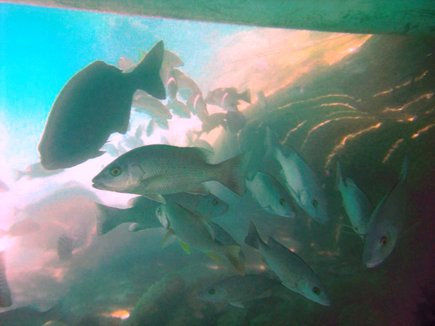

The link to the original repo can be found below. We acknowledge and are grateful to these developers for their contributions.

Project: Enhancement-of-Underwater-Images-with-Statistical-Model-of-BL-and-Optimization-of-TM 

Link: https://github.com/wangyanckxx/Enhancement-of-Underwater-Images-with-Statistical-Model-of-BL-and-Optimization-of-TM

Here is the list of libraries you need to install to execute the code:

'''python = 3.6'''

'''cv2'''

'''numpy'''

'''scipy'''

'''matplotlib'''

'''scikit-image'''

'''natsort'''

### Comparison between before and after applying the enhancement on an underwater Image

<table>
  <tr>
    <td>BEFORE</td>
     <td>AFTER</td>
  </tr>
  <tr>
    <td></td>
    <td></td>
  </tr>
 </table>

## Citation

<h3>Article:Review of Image Enhancement and Image Restoration Methods</h3>
    
Author    = Yan Wang, Wei Song, Giancarlo Fortino, Lizhe Qi, Wenqiang Zhang, Antonio Liotta 
    Title     = An Experimental-based Review of Image Enhancement and Image Restoration Methods for Underwater Imaging 
    Journal   = IEEE Access，DOI:10.1109/ACCESS.2019.2932130 
    Year      = 2019

<h3>Article:Review of Image Enhancement and Image Restoration Methods</h3>
   
 Author    = Yan Wang, Wei Song, Giancarlo Fortino, Lizhe Qi, Wenqiang Zhang, Antonio Liotta 
    Title     = An Experimental-based Review of Image Enhancement and Image Restoration Methods for Underwater Imaging 
    Journal   = arXiv:1907.03246 
    Year      = 2019

   
<h3>Article:Underwater Image Enhancement Method</h3>
   
 Author    = Wei Song, Yan Wang, Dongmei Huang, Antonio Liotta, Cristian Perra 
    Title     = Enhancement of Underwater Images with Statistical Model of Background Light and Optimization of Transmission Map 
    Journal   = IEEE Transactions on Broadcasting 
    Year      = 2019

<h3>Article:Underwater Image Enhancement Method</h3>
    
 Author    = Wei Song, Yan Wang, Dongmei Huang, Antonio Liotta, Cristian Perra 
    Title     = Enhancement of Underwater Images with Statistical Model of Background Light and Optimization of Transmission Map 
    Journal   = arXiv:1906.08673 
    Year      = 2019 

